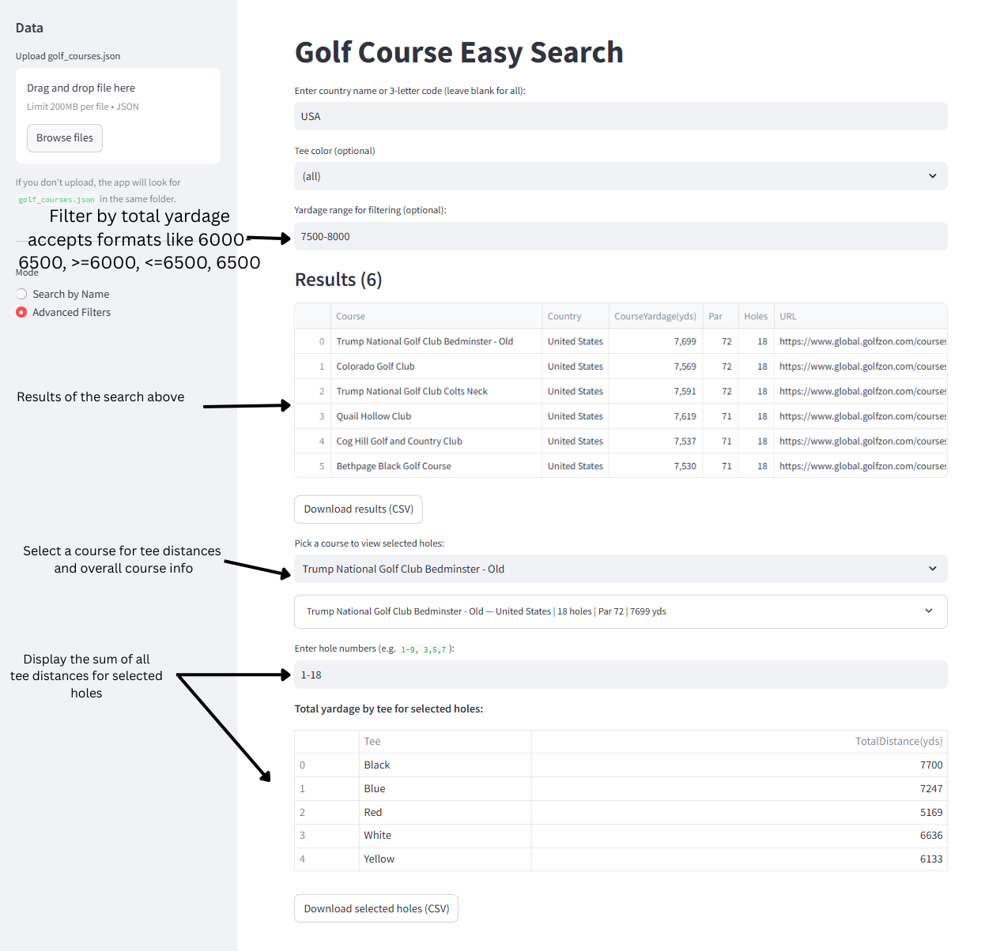

# Golfzon Scraper & Search Tool

This project provides a scraper and an interactive search tool for golf course data from the [Golfzon Global website](https://www.global.golfzon.com/courses/about-course).  

With it, you can:
- Scrape detailed course data (holes, par, yardage, tees).
- Search courses by **name**, **country**, or **tee yardage ranges**.
- View **per-hole data** or calculate **total yardage per tee**.

---

## Project Structure
- easy_search.py # Interactive search tool (CLI)
- golfzon_scraper.py # Scraper to collect/update course data
- golf_courses.json # Saved course data (output of scraper)
- requirements.txt # Python dependencies
- README.md # This file

## Installation

1. **Clone or download this repository.**

2. **Install Python dependencies**:
   pip install -r requirements.txt
   playwright install
   (or python -m playwright install)
## Usage
- python golfzon_scraper.py --limit 5 (optional - can use to limit how many courses are scraped)
- streamlit run visual.py
- (OR python -m streamlit run .\visual.py -- --json         golf_courses.json)


## Example
```markdown



